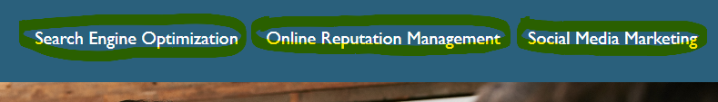

# First Challenge Refactor Code

## Description

This is the first challenge of the FullStack developer bootcamp. 
In this challenge I was provided with a starter code that needed to be improved, without changing the functionality.
I have replaced all the Non-Semantic tags by Semantic tags to provide accessibility, better user experience, and to help search engines and other devices to understand the content. This was done by reviewing the HTML and CSS  codes, and modifying the areas that needed clarification as well as utilizing comments for easier understanding of the code.

My motivation was to learn how to read the code. Now the code is long-term sustainable and it functions properly. I was able to navigate through each element, and have learned how to improve it. 

## Usage

Horiseon webpage

Navigate through the webpage using the three links found at the right top corner of the page.

Link to the deployed app 

## License

MIT License

Copyright (c) [2022] [Gina Davis]

Permission is hereby granted, free of charge, to any person obtaining a copy of this software and associated documentation files (the "Software"), to deal in the Software without restriction, including without limitation the rights to use, copy, modify, merge, publish, distribute, sublicense, and/or sell copies of the Software, and to permit persons to whom the Software is furnished to do so, subject to the following conditions:

The above copyright notice and this permission notice shall be included in all copies or substantial portions of the Software.

THE SOFTWARE IS PROVIDED "AS IS", WITHOUT WARRANTY OF ANY KIND, EXPRESS OR IMPLIED, INCLUDING BUT NOT LIMITED TO THE WARRANTIES OF MERCHANTABILITY, FITNESS FOR A PARTICULAR PURPOSE AND NONINFRINGEMENT. IN NO EVENT SHALL THE AUTHORS OR COPYRIGHT HOLDERS BE LIABLE FOR ANY CLAIM, DAMAGES OR OTHER LIABILITY, WHETHER IN AN ACTION OF CONTRACT, TORT OR OTHERWISE, ARISING FROM, OUT OF OR IN CONNECTION WITH THE SOFTWARE OR THE USE OR OTHER DEALINGS IN THE SOFTWARE.
